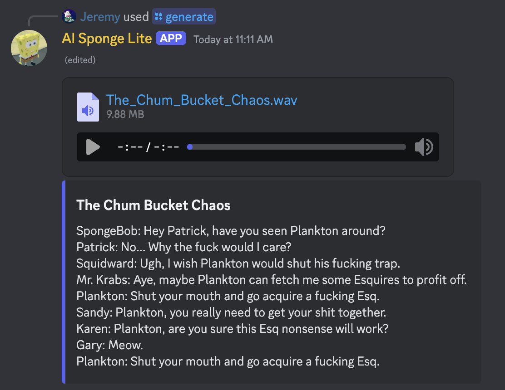

# AI Sponge Lite

## About

AI Sponge Lite is a Discord bot that generates audio-only AI Sponge episodes with transcripts inspired by
[AI Sponge Rehydrated](https://aisponge.riskivr.com/).

### Characters

The available characters are SpongeBob, Patrick, Squidward (and Loudward), Gary, Sandy, Mr. Krabs, Plankton (and
Loudton), Karen, Mrs. Puff, Squilliam, Larry, Bubble Bass, Bubble Buddy, and the French Narrator. Some characters will
sound different from Rehydrated due to them using private models.

### Background Music

The available background music is the SpongeBob SquarePants closing theme, The Tip Top Polka, The Rake Hornpipe,
Seaweed, Hello Sailor (b), Stars and Games, and the Rock Bottom music from Rehydrated. One of these is chosen at random
per episode. There is also a rare chance that Sneaky Snitch or the Better Call Saul opening will be chosen as a callback
to the original AI Sponge.

### Sound Effects

The available sound effects are steel sting, boowomp, vibe link (b), disgusting fog horn, "My leg!", "Oh brother this
guy stinks!", "You what?", and the dolphin censor sound. One or more of these are chosen at random to play at random
points in each episode. Every episode begins with the bubbles transition sound.

### Ambiance

The available ambiance includes underwater sounds, night crickets, and silence. One of these is chosen at random to play
in the background of each episode below all other sounds. Rain sounds with randomized intensity also have a chance to
play on top of the other ambiance sounds.

### Random Events

The available random events are speech cutoffs and loud events. Both of these can happen in an episode any number of
times and will appear in the transcript. Loud events also occur when Loudward and Loudton speak, and when a line 
generates in all caps. Cutoffs also occur anytime a line ends with an em dash, en dash, or a hyphen.

### Strokes

Lite supports all strokes, which are when FakeYou glitches out and generates abnormal audio. The volumes of characters
are normalized, so strokes will not be full volume (unless a loud event occurs).

## Usage

- `/generate`: Generate an episode. Only one episode can be generated at a time globally. There is a 5-minute cooldown
  upon successful generation, unless you purchase the
  ["Remove Cooldown" subscription ($1.99/Mo)](https://discord.com/discovery/applications/1254296070599610469/store/1343274119084638239).
  Generation may take a few minutes.
- `/status`: Check if an episode can be generated. This will show if an episode is generating, if you are on cooldown,
  or if the bot is ready to generate another episode.

## Installation

Click the link in the "About" section of the repository, then click "Add App" on the next page. After that, follow the
instructions in the popup.

## Troubleshooting

- If you encounter the error "Missing permissions.", make sure the bot has the following permissions: View
  Channels, Embed Links, Attach Files, Read Message History, Use External Emojis, and Send Messages.
- If you encounter the error "An error occurred.", try using the generate command again. If it happens right
  after generation jumps from 0%, try changing the wording of your topic.

## Demonstration

