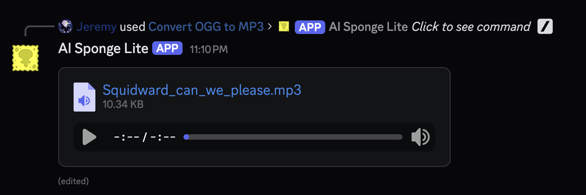
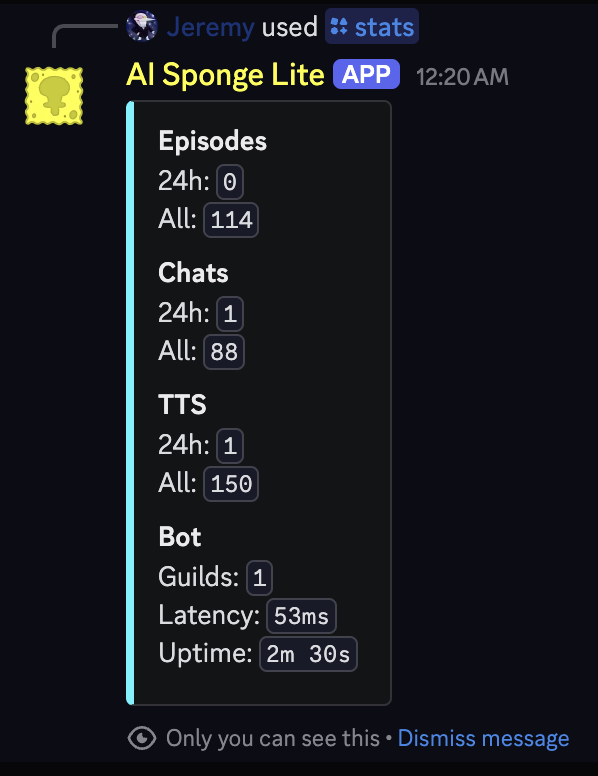

# AI Sponge Lite

## About

AI Sponge Lite is a Discord bot that generates parody AI Sponge audio episodes, chats, and TTS inspired by 
[AI Sponge Rehydrated](https://aisponge.riskivr.com/).

Available characters include SpongeBob, Patrick, Squidward, Gary, Sandy, Mr. Krabs, Plankton, Karen, Mrs. Puff, 
Squilliam, Larry, Bubble Bass, Bubble Buddy, DoodleBob, and French Narrator. Some characters will sound different from 
Rehydrated due to them using local models. There are also many character alts that can only appear in episodes when 
mentioned in topics, which are up to you to discover!

## Usage

### Slash Commands

- `/episode`: Generate an episode. Only one episode can be generated at a time globally. There is a 5-minute cooldown
  upon successful generation, unless you purchase the
  ["Remove Cooldown" subscription ($1.99/Mo)](https://discord.com/discovery/applications/1254296070599610469/store/1343274119084638239).
- `/chat`: Chat with a character. This can be used at any time anywhere and does not have a cooldown.
- `/tts`: Synthesize character speech. This can be used whenever an episode is not generating and does not have a
  cooldown.
- `/stats`: Show bot statistics. See how many generations have been completed in the last 24 hours and for all
  time, and view the bot uptime.
- `/help`: Show bot help. This will show a link to the Discord App Directory page.

### Context Menu Commands

- `Convert OGG to MP3`: Convert an episode or TTS output in OGG format to MP3, useful for devices that do not support
  OGG format.

## Installation

Click the link in the "About" section of the repository, then click "Add App" on the next page. After that, follow the
instructions in the popup.

## Troubleshooting

If you encounter "Generation failed.", try again later. If this occurs immediately after generation progresses past 0%, 
try rewording your topic. Quotation marks and similar punctuation can cause problems.

## Demonstration

