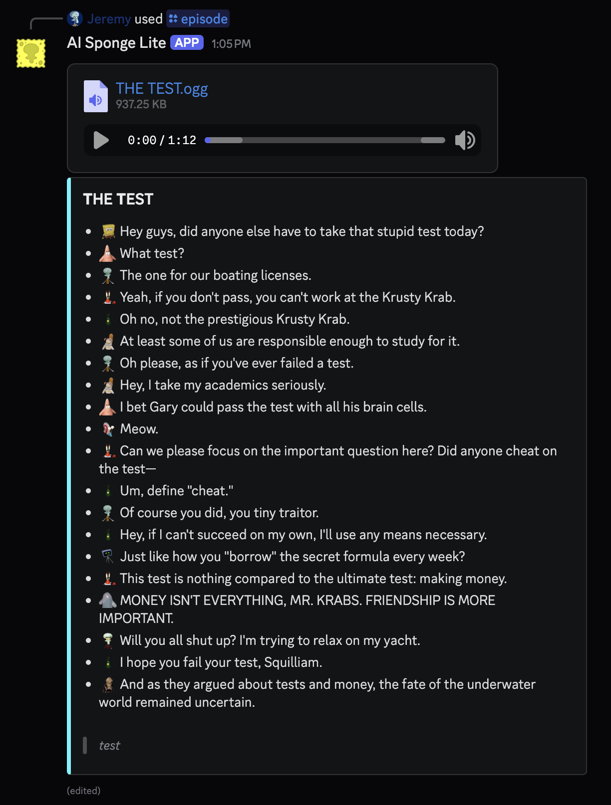
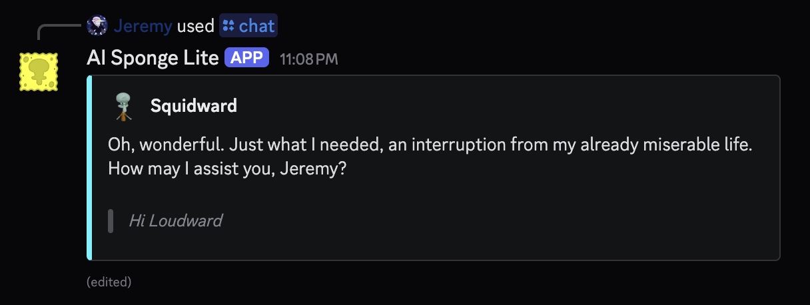
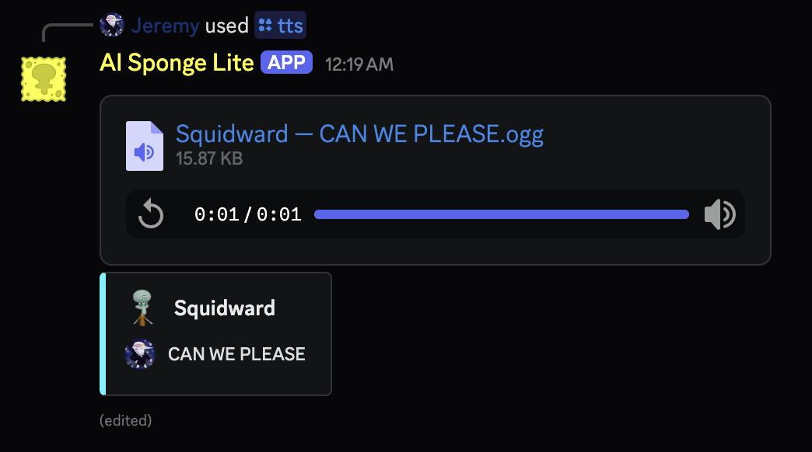

# AI Sponge Lite

## About

AI Sponge Lite is a self-hosted Discord bot that generates parody AI Sponge audio episodes, chats, and TTS inspired by
[AI Sponge Rehydrated](https://aisponge.riskivr.com/).

### Characters

SpongeBob, Patrick, Squidward, Mr. Krabs, Plankton, Karen, Gary*, Sandy, Mrs. Puff, Larry*, Squilliam*, Bubble Bass*,
Bubble Buddy, DoodleBob, Realistic Fish Head, and French Narrator.

*voice differs from current Rehydrated voice.

### Locations

SpongeBob's House, Patrick's House, Squidward's House, Sandy's Treedome, Krusty Krab, Chum Bucket, Boating School, News
Studio, Rock Bottom, and Bikini Bottom.

## Usage

Only one of the following commands can be used at a time globally.

- `/episode`: Generate an audio-only episode.
- `/chat`: Chat with a character.
- `/tts`: Synthesize character speech.

## Demonstration

## Installation

### Discord Bot Token

1. Log in to the [Discord Developer Portal](https://discord.com/developers/applications).
2. In the top right corner, click on "New Application".
3. Name your application (e.g., "AI Sponge Lite"), click the checkbox at the bottom of the popup, and click "Create".
4. In the left sidebar, click on "Bot".
5. Scroll down slightly and click on "Reset Token". Then click "Yes, do it!" to confirm.
6. Copy the token. You will need it later.

Do not worry about uploading an avatar, a banner, or any emojis. When running the bot for the first time, they will
upload automatically.

### OpenAI API Key

1. Log in to the [OpenAI Platform](https://platform.openai.com/).
2. In the top right corner, click the settings icon.
3. In the left sidebar, click on "API Keys".
4. In the top right, click on "Create new secret key".
5. Name the key (e.g., "AI Sponge Lite"), select a project, and click "Create secret key".
6. Copy the key. You will need it later.

### Install Script

The following instructions are for Linux (Ubuntu, Debian, Fedora, Red Hat, and CentOS). For Windows, please install WSL,
then follow these instructions. MacOS is not supported by the install script at the moment.

1. From this repository, download the `install.sh` script. Save it where you would like to install the bot. Do not 
   download the entire repository.
2. Open a terminal and navigate to the directory where you saved the script.
3. Run the script with the command `sudo bash install.sh`.
4. When prompted, enter the Discord bot token and OpenAI API key you copied earlier.
5. Once the script is finished, you can delete the `install.sh` script.

After all of these steps, the bot should be installed in a folder called `AISpongeLite` in the directory where you ran
the script. The bot will automatically start on boot and run in the background.