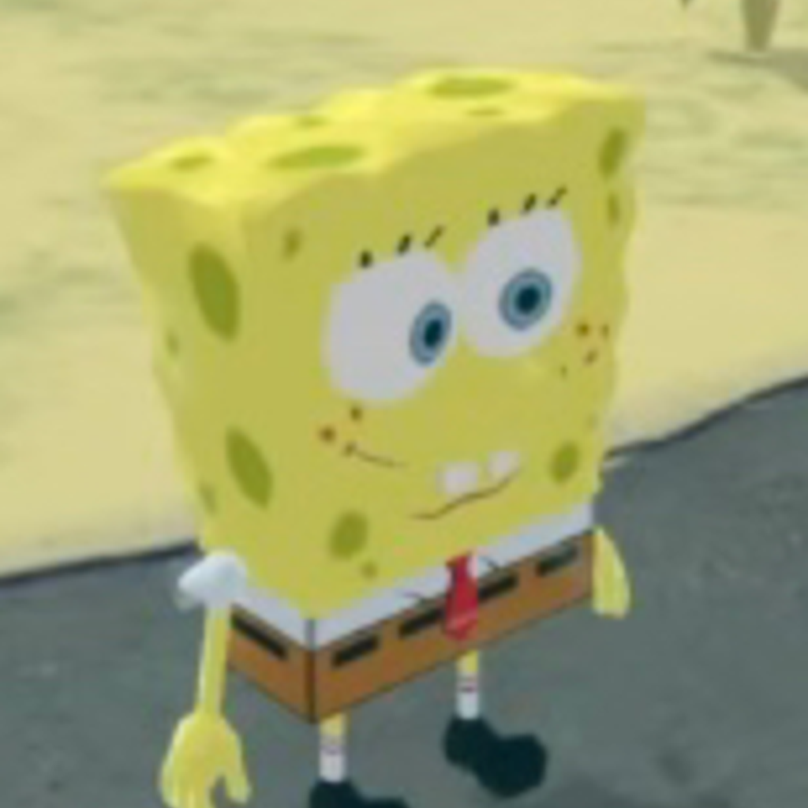
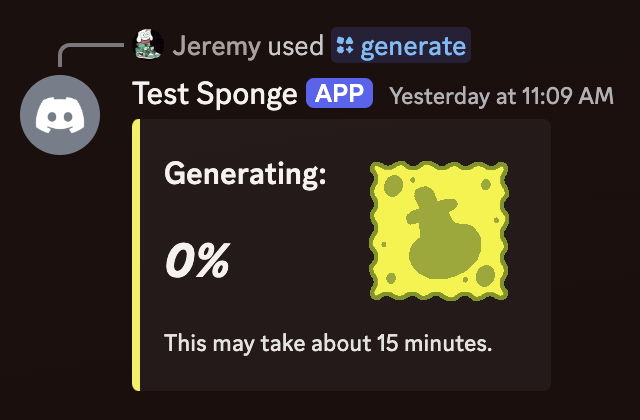

# AI Sponge Lite

## About

AI Sponge Lite is a Discord bot that generates audio-only episodes with transcripts inspired by AI Sponge and AI Sponge
Rehydrated.

## Usage

- `/generate`: Generate an episode. Only one episode can be generated at a time globally. There is a 10-minute cooldown
  if the command succeeds. Characters that can appear in episodes are:
    - SpongeBob
    - Patrick
    - Squidward
    - Loudward
    - Gary
    - Sandy
    - Mr. Krabs
    - Plankton
    - Karen
    - Mrs. Puff
- `/status`: Check if an episode can be generated.

## Demonstration

    
    

