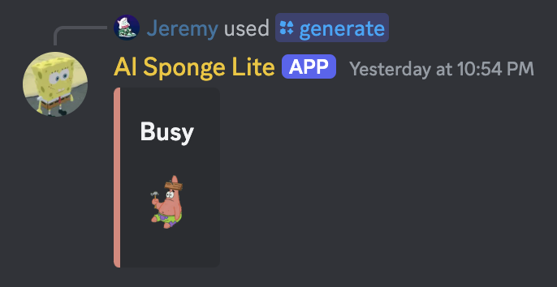
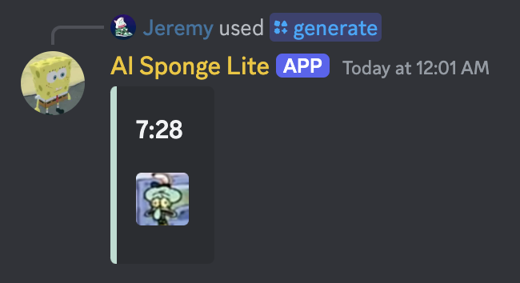
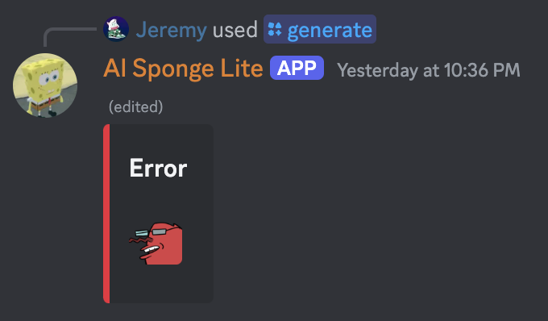

# AI Sponge Lite

## About

AI Sponge Lite is a Discord bot that generates audio-only AI Sponge episodes with transcripts.

## Purpose

This bot was created because I like AI Sponge and the way it works. I wanted to try a similar concept myself with less
of a visual aspect. This bot can allow people to enjoy AI Sponge when the original streams are down.

## Usage

This bot adds the `/generate` command, which takes a topic as an argument. The bot will then generate the episode,
providing status updates as it does. If generation completes successfully, the user will be put on a 30-minute cooldown
to allow other users a chance to use the bot. Only one episode can be generated at a time.

## Requirements

Python 3 is required to set up and run this bot.

## Installation

1. Download or clone this repository and navigate to the directory
2. Create a venv with `python3 -m venv venv`
3. Activate the venv with `source venv/bin/activate`
4. Install the requirements with `python3 -m pip install -r requirements.txt`
5. Create a `.env` file with the following

```env
DISCORD_BOT_TOKEN=bot_token_here
OPENAI_API_KEY=openai_api_key_here
FAKEYOU_USERNAME=fakeyou_username_here
FAKEYOU_PASSWORD=fakeyou_password_here
```

## Running

1. Activate the venv with `source venv/bin/activate`
2. Run the bot with `python3 main.py`

## Demonstration

<div align="center">
    
    
    
    
    
</div>

## Troubleshooting

FakeYou sometimes breaks and gives no reason as to why. Simply restart the bot if it gets stuck.
